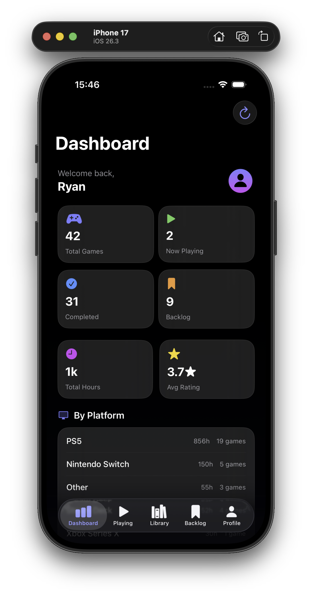
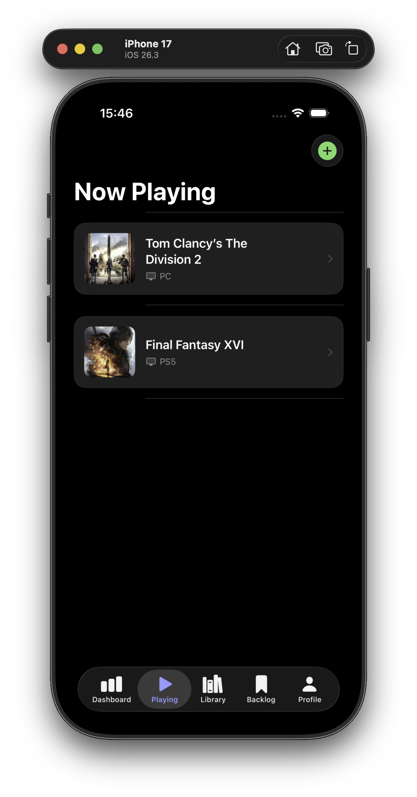
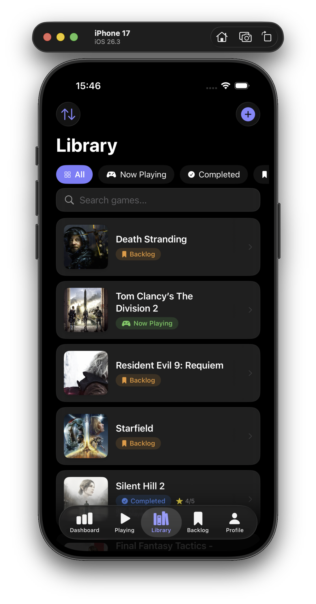
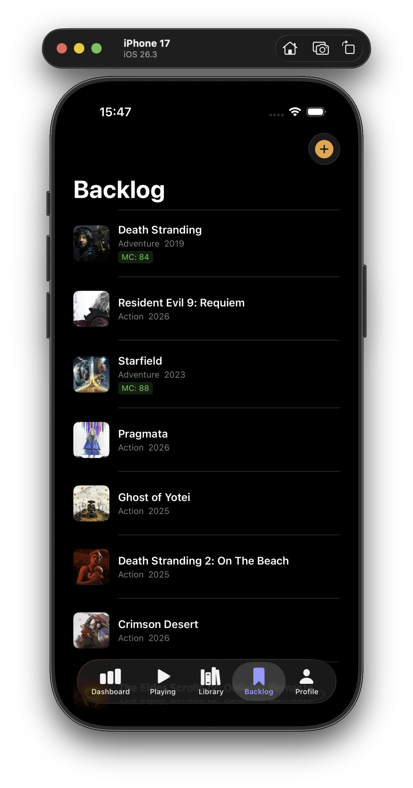
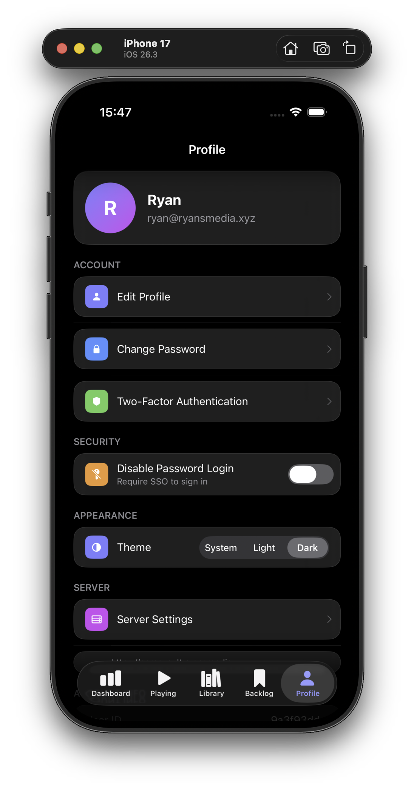

# GameVault iOS

A native Swift iOS app for [GameVault](https://github.com/rcoupland91/gamevault) — your self-hosted personal game library manager. Built with SwiftUI and Liquid Glass design for iOS 17+.

## Screenshots

<p align="center">
  
  
  
  
  
</p>

## Features

- **Full Authentication** — Login, register, two-factor auth (TOTP + email OTP), OIDC/SSO, JWT with auto-refresh via Keychain
- **Dashboard** — Live stats: total games, hours played, platform breakdown, genre breakdown, recent activity
- **Now Playing** — Quick access to currently playing games; swipe right to complete, swipe left to delete
- **Game Library** — List view with status filtering (Playing / Completed / Backlog), search, sort, and swipe actions
- **Backlog** — List view with swipe-to-play gesture
- **Game Detail** — Full editing: title, status, rating (★★★★★), hours, platform picker, genre, review, notes
- **Add Games** — Search RAWG.io game database (with platform picker) or add manually
- **Profile** — Edit profile, change password, 2FA status, SSO/password login toggle, server configuration
- **Admin Panel** — User management (for admin accounts)
- **Liquid Glass Design** — iOS 26 `.glassEffect()` with iOS 17/18 fallback using materials
- **Real-time Sync** — All data pulled directly from your GameVault server API

## This is a standalone repo

This project lives in its own GitHub repository separate from the GameVault server. To set it up:

```bash
# 1. Create a new repo on GitHub called "gamevault-ios", then:
git clone https://github.com/YOUR_USERNAME/gamevault-ios
cd gamevault-ios

# 2. Copy the contents of the ios/ folder from the main gamevault repo into it
#    (everything inside ios/ becomes the root of this repo)

# 3. Update altsource.json — replace YOUR_USERNAME with your actual GitHub username
#    in the sourceURL and iconURL fields

# 4. Push to main — GitHub Actions will validate the build automatically
git add . && git commit -m "feat: initial iOS app" && git push
```

To release a new IPA:
```bash
git tag v1.0.0 && git push origin v1.0.0
```
The `release.yml` workflow builds the unsigned IPA, creates a GitHub Release with it attached, and updates `altsource.json` automatically.

---

## Requirements

- **Xcode 16+**
- **iOS 17.0+** deployment target (iOS 26 for full Liquid Glass effects)
- A running [GameVault](https://github.com/rcoupland91/gamevault) server instance
- `xcodegen` (recommended — `brew install xcodegen`)

## Local Xcode Setup

### 1. Generate Xcode Project

**Using xcodegen (recommended):**
```bash
brew install xcodegen
cd ios/GameVaultApp
xcodegen generate
open GameVaultApp.xcodeproj
```

**Manual setup in Xcode:**
1. Open Xcode → File → New → Project
2. iOS → App
3. Product Name: `GameVaultApp`, Bundle ID: `com.gamevault.app`
4. Interface: SwiftUI, Language: Swift, Min Deployment: iOS 17
5. Delete generated `ContentView.swift`
6. Drag all files from `Sources/GameVaultApp/` into the project
7. Ensure "Copy items if needed" is checked

### 2. Configure Signing

In Xcode:
- Select the `GameVaultApp` target
- Signing & Capabilities → Team: select your Apple Developer account
- Bundle Identifier: `com.gamevault.app` (or customise)

### 3. Build & Run

Select your device/simulator and press **⌘R**.

### 4. Connect to Your Server

On first launch, tap **Configure Server** and enter your GameVault server URL:
- Local network: `http://192.168.1.x:3000`
- Remote/tunnel: `https://gamevault.yourdomain.com`

Log in with your existing GameVault credentials — all your data will sync automatically.

## Architecture

```
Sources/GameVaultApp/
├── App/
│   └── GameVaultApp.swift          # @main entry point, RootView
├── Models/
│   └── Models.swift                # User, Game, Stats, RAWG types
├── Services/
│   ├── APIService.swift            # Core HTTP client, token refresh
│   ├── AuthService.swift           # Auth endpoints
│   ├── GameService.swift           # Game CRUD + RAWG search
│   └── KeychainService.swift       # Secure token storage
├── ViewModels/
│   ├── AuthViewModel.swift         # Login/register/2FA state
│   ├── GameListViewModel.swift     # Library/search/add state
│   └── DashboardViewModel.swift    # Stats state
└── Views/
    ├── Auth/
    │   ├── LoginView.swift         # Login + register tabs
    │   ├── TwoFactorView.swift     # TOTP / email OTP
    │   └── ServerSetupView.swift   # Server URL configuration
    ├── Main/
    │   ├── MainTabView.swift       # Tab bar + Now Playing + Backlog
    │   └── DashboardView.swift     # Stats dashboard
    ├── Games/
    │   ├── GameListView.swift      # Library grid + filters
    │   ├── GameDetailView.swift    # Edit game sheet
    │   └── AddGameView.swift       # RAWG search + manual add
    ├── Profile/
    │   └── ProfileView.swift       # Settings, admin panel
    └── Components/
        └── GlassComponents.swift   # Reusable Liquid Glass UI
```

## Liquid Glass Design

This app uses Apple's **Liquid Glass** design language:

| iOS Version | Implementation |
|------------|----------------|
| iOS 26+    | `.glassEffect()` native API, automatic tab bar glass |
| iOS 17–25  | `.ultraThinMaterial`, custom blur + stroke borders |

Key components:
- `GlassCard` — Glass surface container
- `GlassButton` — Primary/secondary/glass button variants
- `GlassTextField` — Frosted input fields
- `GameArtworkView` — Async game artwork with glassmorphism placeholder

## API Compatibility

This app connects to the GameVault REST API. All data remains on your server — the app is purely a native client. Your web UI and this iOS app share the same backend and data seamlessly.

**Supported endpoints:**
- `/api/auth/*` — Authentication, 2FA, profile
- `/api/games/*` — CRUD, stats summary
- `/api/rawg/*` — Game search and details
- `/api/settings/*` — Server settings
- `/api/admin/*` — User management

## Security

- JWT access tokens stored in iOS **Keychain** (not UserDefaults)
- Automatic token refresh (15-minute access token TTL)
- Local network access configured for HTTP (development/home server use)
- For production use over HTTPS, no additional configuration needed

## Installing via AltStore

Once you've pushed a tag and the release workflow has run:

1. Open **AltStore** on your iPhone
2. Tap the **Browse** tab → tap the **+** (Sources) button
3. Paste your source URL:
   ```
   https://raw.githubusercontent.com/YOUR_USERNAME/gamevault-ios/main/altsource.json
   ```
4. Find **GameVault** in Browse and tap **Install**
5. AltStore re-signs the IPA with your Apple ID — no paid developer account needed

**Refresh:** With a free Apple ID, AltStore apps expire after 7 days. Keep AltStore running in the background or open it periodically to auto-refresh. With [AltStore PAL](https://altstore.io) or a paid Apple Developer account, this limit doesn't apply.

---

## GitHub Actions Workflows

| Workflow | Trigger | What it does |
|---|---|---|
| `build.yml` | Push / PR to main | Builds unsigned IPA, saves as artifact (14-day retention) |
| `release.yml` | Push tag `v*` | Builds IPA, creates GitHub Release, uploads IPA, updates `altsource.json` |

No secrets or certificates needed — the IPA is unsigned and AltStore handles signing.

---

## Contributing

Pull requests welcome! This project follows the same philosophy as GameVault — simple, self-hosted, no telemetry.
